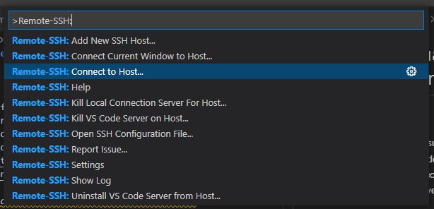
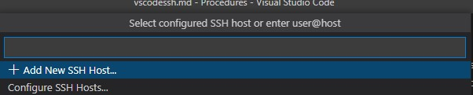
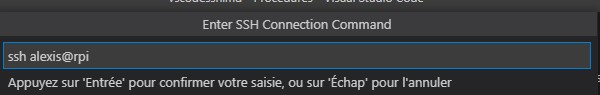
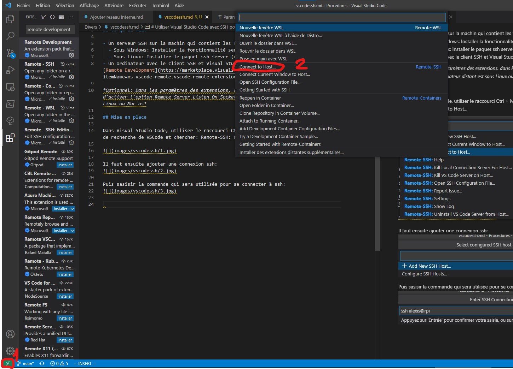

# Utiliser Visual Studio Code avec SSH pour éditer des fichiers sur une autre machine

## Ce qu'il faut

- Un serveur SSH sur la machin qui contient les fichiers à modifier
  - Sous Windows: Installer la fonctionnalité serveur SSH et la configurer
  - Sous Linux: Installer le paquet ssh server (openssh-server sur debian)
- Un ordinateur avec le client SSH et Visual Studio Code installé avec l'extension [Remote Development](https://marketplace.visualstudio.com/items?itemName=ms-vscode-remote.vscode-remote-extensionpack)

*Optionnel: Dans les paramètres des extensions, dans Remote - SSH, il est conseillé d'activer l'option Remote Server Listen On Socket si votre ordinateur distant est sous Linux ou Mac os*

## Mise en place

Dans Visual Studio Code, utiliser le raccourci Ctrl + Maj + P pour afficher la barre de recherche de VSCode et chercher: Remote-SSH: Connect to Host...

Il faut ensuite ajouter une connexion ssh:

Puis sasisir la commande qui sera utilisée pour se connecter à ssh:

Cliquer sur les 2 flèches avec le carré vert en bas à gauche puis choisir Connect to Hot.

Ensuite, sur l'hote distant vscode server va s'installer.

Pour plus d'informations:
https://marketplace.visualstudio.com/items?itemName=ms-vscode-remote.vscode-remote-extensionpack