# Installation de Debian 10

En démarrant sur le média d'installation on arrive sur ce menu:

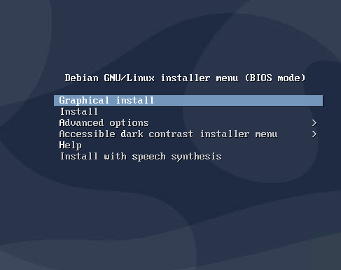

> Il faut choisir Graphical Install ou Install pour installer Debian
> Le mode Accessible dark contrast installer menu permet d'avoir un mode d'installation en noir et blanc pour les malvoyants.

**On choisi le mode Graphical Install pour continuer**

Après la configuration de langue et de la disposition du clavier, on doit nommer la machine:

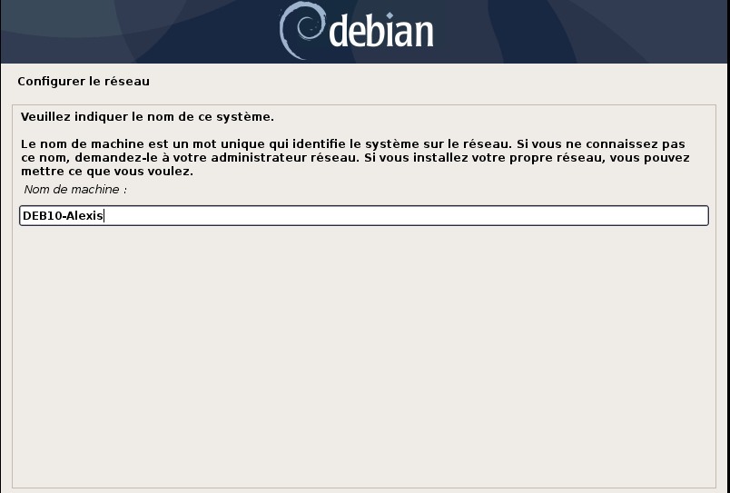

Ensuite, on paramètres nos comptes utilisateurs, le root ainsi que le compte principal.

On arrive sur le partitionnement de disque:

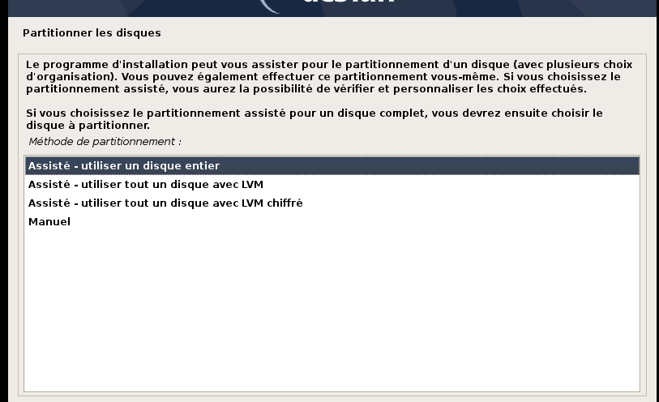

> Ici, on à plusieurs choix:  
> On peux utiliser le mode Asisté qui permet de crée automatiquement les partitions, avec ou sans LVM  
> On peux également utiliser le mode manuel qui permet une gestion précise des partitions.

**Pour la suite, je vais détailler le mode de partionnement manuel**  

1. On choisi le disque à partitionner:  
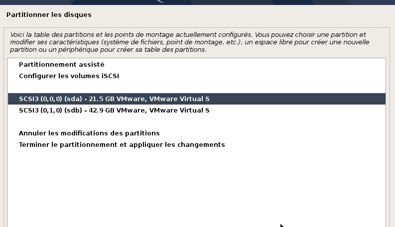

Autoriser ensuite la création d'une table de partition

2. On choisi de configuer le gestionnaire de volumes logiques (LVM):
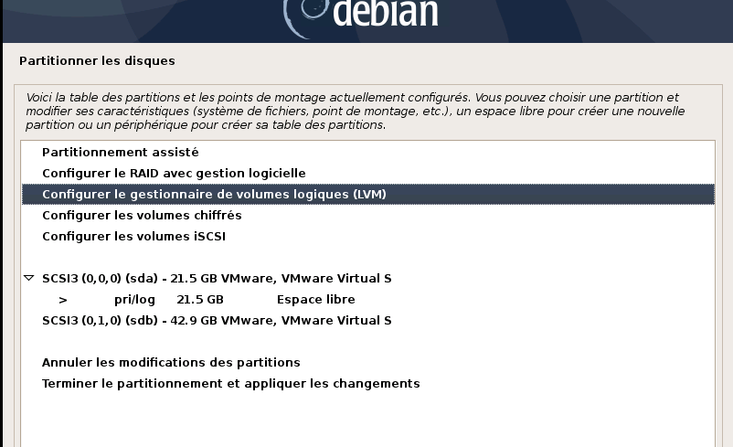

Répondre oui pour l'écriture des modifications sur les disques

3. On choisi de crée un groupe de volumes:
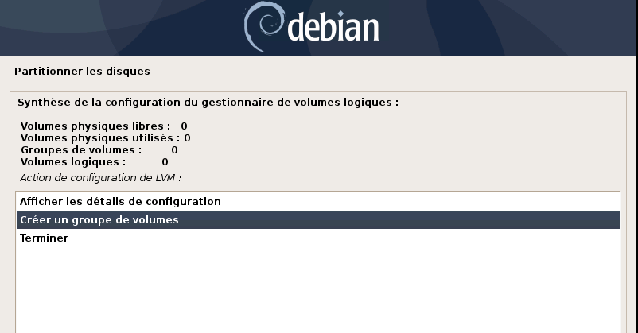

Il faut ensuite le nommer

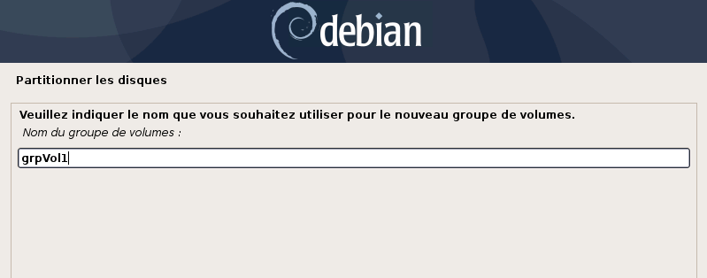

4. On choisi sur quel disque sera le groupe de volume
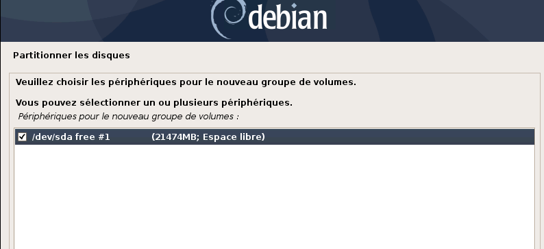

Valider l'écritue des modifications sur les disques et configurer LVM

5. On crée maintenant Nos volumes
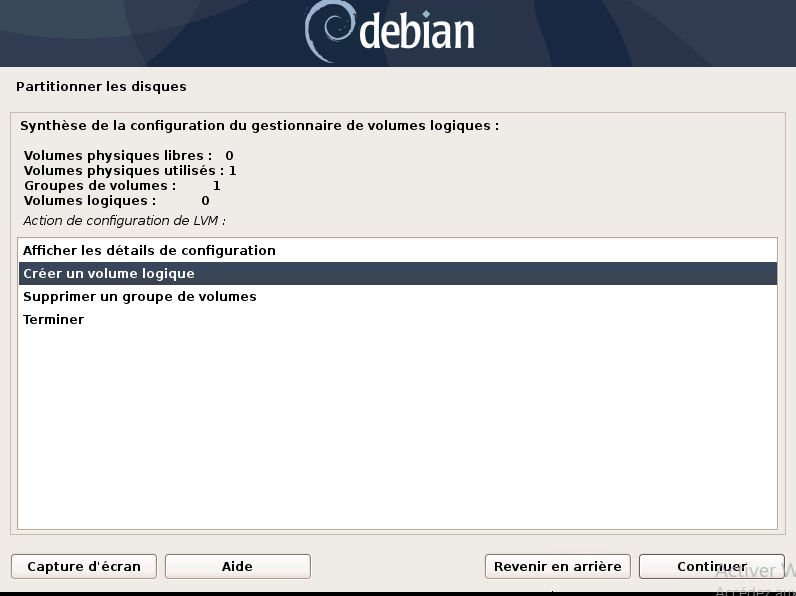

Choisir ensuite le groupe de volume sur lequel sera le volume puis le nommer

> **IMPORTANT** Il est important de nommer astucieusement les volumes

Indiquer ensuite la taille du volume, on peux mettre un K,M,G,T pour aller plus vite.

Répeter ensuite l'opération pour les différents volumes à créer.

6. Ensuite, pour chaque volume, on le configure pour qu'il soit utiliser correctement:

   1. On choisi Utiliser comme:
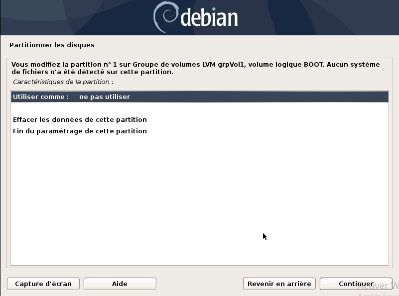

   2. On choisi le type de système de fichier (pour une volume swap, choisir espace d'échange ("swap") ):

   3. On paramètre ensuite la partition (point de montage, nom):
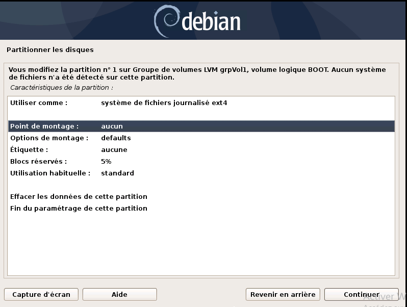

    > **NOTE** Une fois terminer, on choisi fin du paramétrage de cette partition

   4. On paramètre le point de montage de la partition:
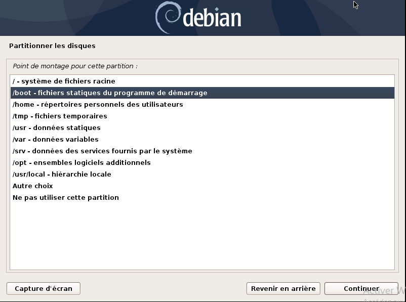

On recommence pour chaque volume.

 7. On nous demande si il faut analyser un autre CD ou DVD:
      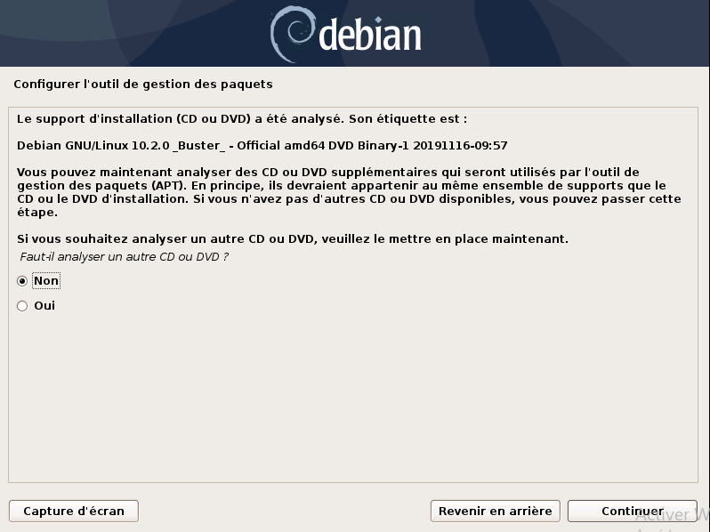

    > Dans le cas ou il y a des paquets à installer via dvd on peux dire oui, cependant ce cas est rare

 8. L'ajout de mirroir réseau

On met que l'on veux ajouter un mirroir
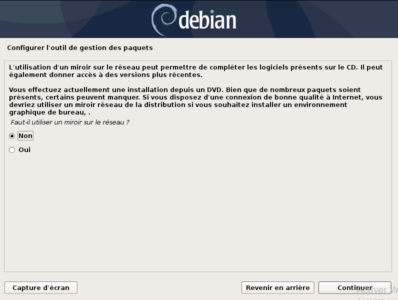

On choisi le pays:
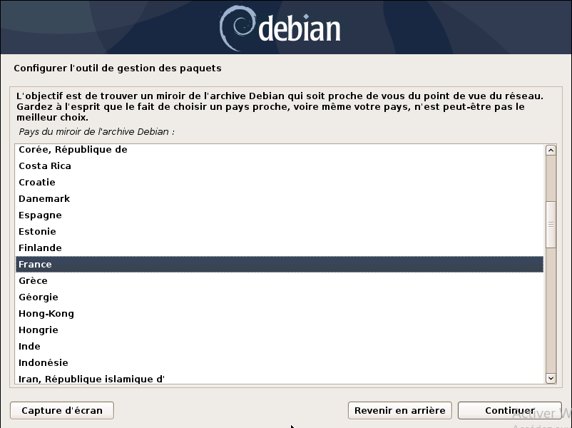

Puis le miroir à utiliser:
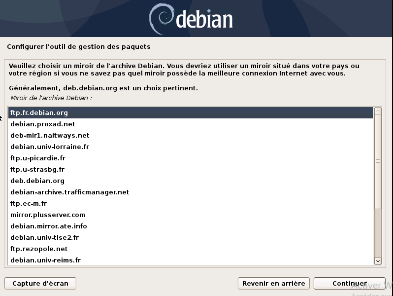

 9. En cas d'utilisation d'un proxy on le rempli, sinon on laisse vide:
  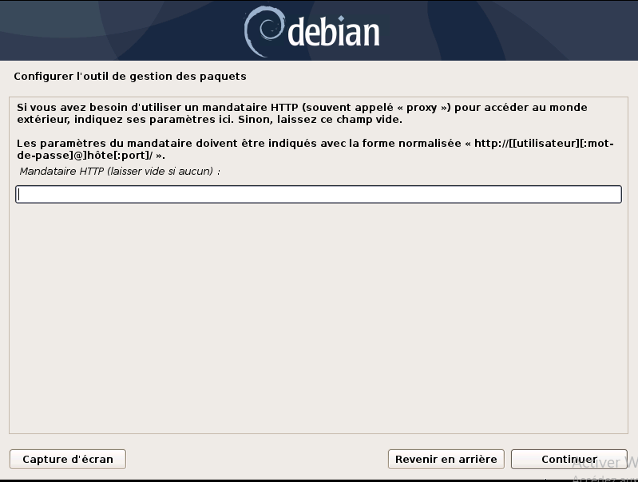
  
 10. L'envoi de rapport à Debian, mettre non par défaut:
 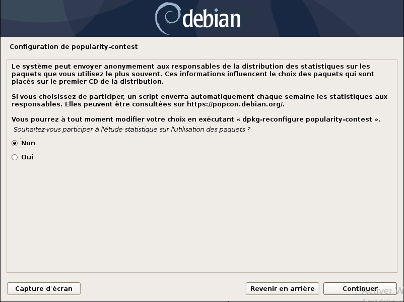

 11. On choisi ensuite les logiciels à installer:
 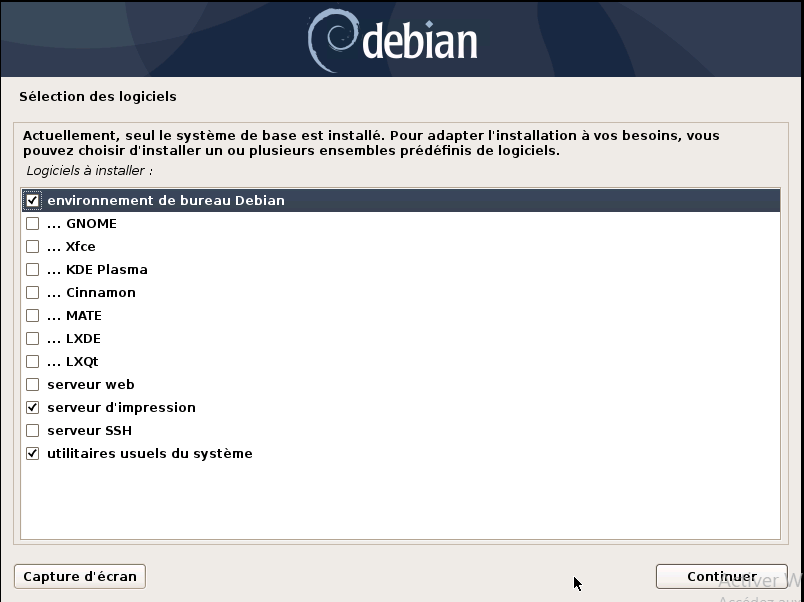

> Si environnement de Bureau est sélectionner mais aucun environnement de bureau n'a été choisi, gnome est installé par défaut.

> On peux installer également depuis ce menu le serveur ssh ainsi qu'un serveur web.

 12. On choisi d'installer le GRUB:
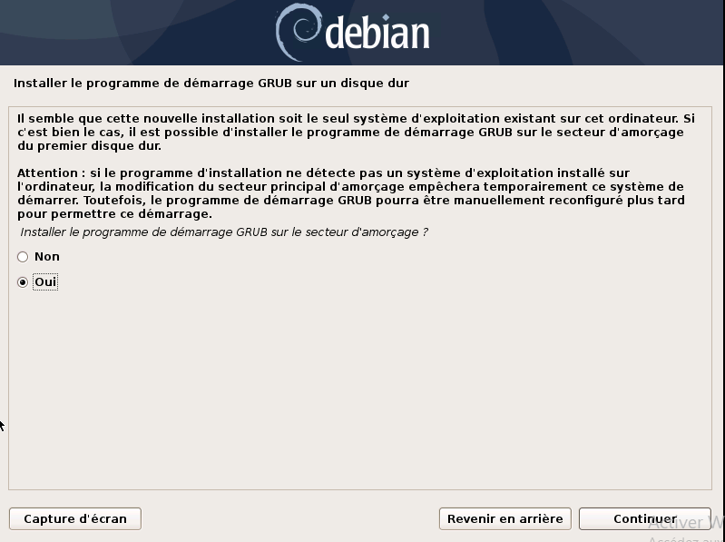

On indique sur quel disque installer le GRUB (de préférence, sur le disque où est installer le système).

 13. Ensuite on redémarre le système