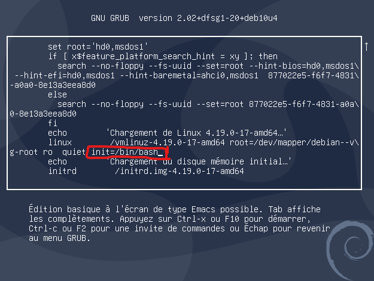
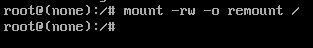

# Réinitialiser le mode de passe root depuis le GRUB

1. Au démarrage de l'ordinateur, lorsque l'on arrive sur le GRUB, on appui alors sur e pour entrer dans la configuration de démarrage du GRUB


2. Il faut ensuite chercher la ligne 
```
linux   /boot/vmlinuz-4.19.0-17-amd64 root=/dev/mapper/debian--v\g-root ro quiet 
```


3. Ensuite il faut ajouter à la fin de la ligne
```
init=/bin/bash
```

> **NOTE**  
> Le clavier est en qwerty



On appui ensuite sur F10 ou ctrl+x pour démarrer

4. On arrive ensuite sur une interface en mode root, on remonte la partition / en mode lecture et écriture
```
# mount -rw -o remount /
```



5. Il reste juste a changer le mot de passe de l'utilisateur root avec la commande
```
passwd root
```

et enfin on redémarre, la commande de redémarrage ne marche pas donc on redémarre avec le bouton de l'ordinateur ou ctrl+alt+suppr.


Valider le changement: exec /sbin/init
