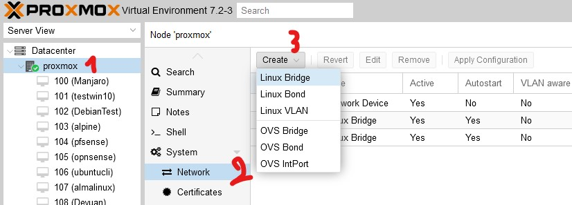
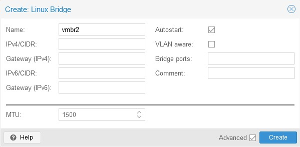

# Crée un réseau interne sur Proxmox

Pour crée l'équivalent d'un réseau interne comme les VMnet sur Proxmox, il faut aller dans le noeud proxmox souhaité puis dans System, choisir Network, ensuite il faut crée un Linux Bridge (il n'est pas obligatoire de saisir les informations de réseau):

