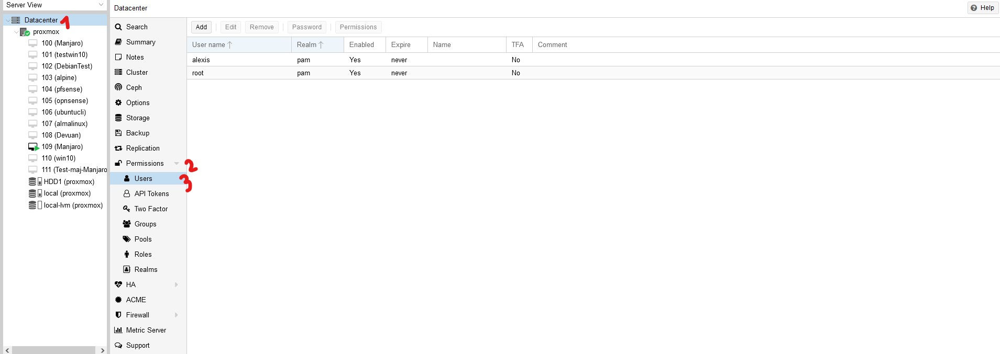
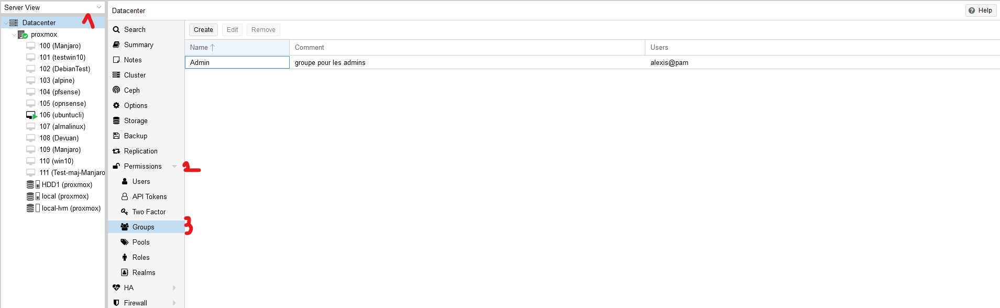
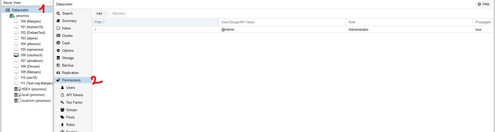

# Gestion des utilisateurs et de leurs droits sur proxmox

## Crée et gérer un utilisateur

Pour crée ou modifier un utilisateur, il faut aller dans: Datacenter -> Permissions -> Users

## Crée un groupe

Pour créer un groupe, il faut aller dans: Datacenter -> Permissions -> Groups

## Gérer les droits des groupes

Pour gérer les permissions des groupes, il faut aller dans: Datacenter -> Permissions 

Ensuite, il faut cliquer sur Add pour ajouter des permissions à un groupe.
Pour donner une permission à un utilisateur il faut l'ajouter à un groupe et donner les droits à ce groupe.