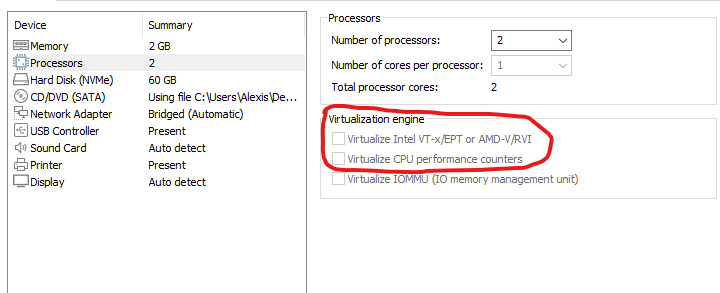

# Activer la virtualisation sur une machine virtuelle sous VMWare:

Lorsque la VM est éteinte, il faut aller dans VM -> Settings -> Processors et cocher les 2 premières options du cadre Virtualization engine.

