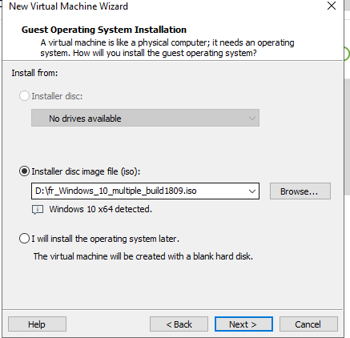
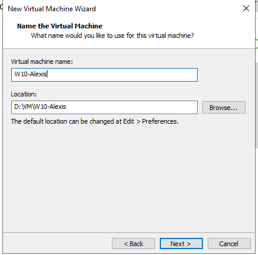
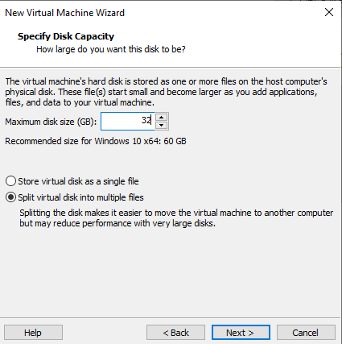
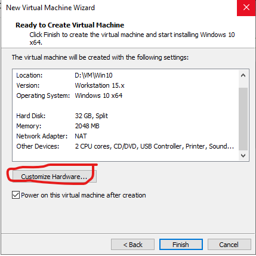
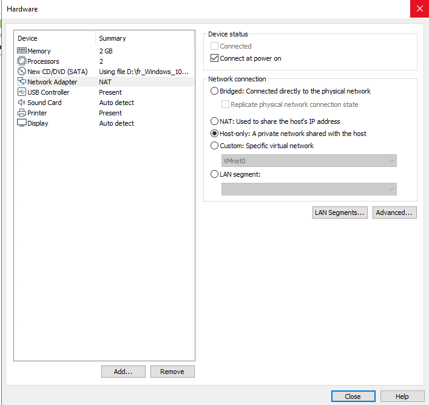

# Création de machines virtuelles

Lancer VMWare, aller dans file -> New Virtual Machine...

Choisir ensuite le mode d'installation:  
- Typical donne moins d'options mais crée facilement une machine virtuel  
- Custom permet par exemple d'installer windows automatiquement et de crée une machine virtuel pour VMWare 15 à partir de VWMWare 16

Choisir ensuite l'iso de la machine, VMWare devrais reconnaitre tout seul le système d'exploitation de l'iso.

Indiquer ensuite le nom de la machine:

Choisir ensuite la taille et le type de fichier utiliser pour le disque dur:

> ***NOTE***   
> Le mode single file permet de crée dès maintenant un seul gros fichier de la taille du disque dur mais est plus lent lors de la lecture.  
> Le mode multiple file permet de sotcker le disque dur dans plusieurs fichier et alloue dynamiquement la taille du disque dur

On arrive ensuite à l'étape de personnalisation du matériel de la machine virtuelle:

> ***NOTE***  
> Si on ne veux pas que la machine virtuelle démarre directement, il faut décocher Power on this virtual machine after creation  
> Cela permet d'ajouter des disques dur par exemple.

Ecran de personnalisation de la VM:

La machine virtuelle est maintenant crée et prête à être utilisée.  
Avant de démarrer la machine, il est possible de gérer son matériel [en allant par ici](Gerer%20la%20configuration%20des%20machines%20virtuelles.md).

