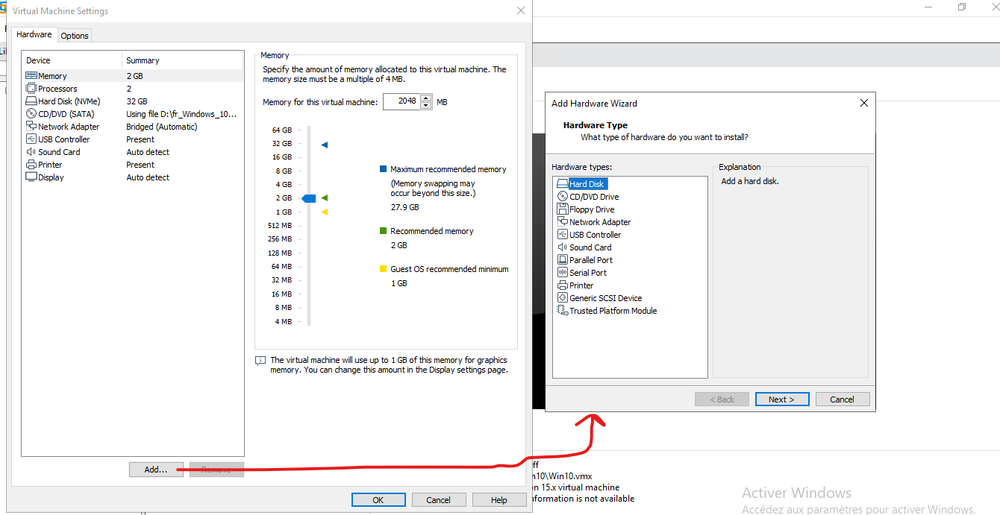

# Gestion de la configuration materielle des machines virtuelles

## 1. Ajouter Un disque dur (ou un autre périphérique) à la machine virtuelle

Lorsque la machine virtuelle est éteinte, il faut aller dans VM -> Settings

---
## 2. Les modes de connexions à internet de la machine virtuelles

On trouve les modes de connexion suivant:  

Explication des différents modes:  
- NAT: Permet à la machine virtuelle de se connecter au réseau externe et aux autres machines virtuelles, mais pas à la machine hote
- Host only: La machine à seulement accès à un réseau interne entre la machine hote et la machine virtuelle
- Bridged: Permet d'avoir accès au réseau externe, au réseau entre les différentes machines virtuelles et permet la communication entre la machine virtuelle et la machine hote. Il s'agit du mode le plus permissif.

- Le mode Custom: Il permet d'utiliser une connexion bridged ou NAT personnalisée, notament en fonction de la carte réseau de la machine hôte à utiliser. Il faut passer pas le Virtual Network Editor pour crée ces connexions.

Tableau récapitulatide (inspiré de [l'article de malekal sur le sujet]](https://www.malekal.com/vmware-differences-nat-vs-bridged-vs-host-only/)):

| Type de connexion | accès réseau externe (internet) | accès réseau entre machine virtuelles | accès machine hote <-> machine virtuelle |
|:-:|:-:|:-:|:-:|
| NAT | ✔ | | ✔ |
| Host Only | | ✔ | |
| Bridged | ✔ | ✔ | ✔ |

---
## 3. Virtual Network Editor

Cette option se trouve dans Edit -> Virtual Network Editor.  
On peux ici crée un nouvelle connexion, dans le cas ou l'on a plusieurs interfaces de connexion à internet, il peux être intéressant de crée un profil pour chaque carte réseau, notamment en mode bridged.

> TODO Compléter avec des images et plus d'information sur le Virtual Network Editor