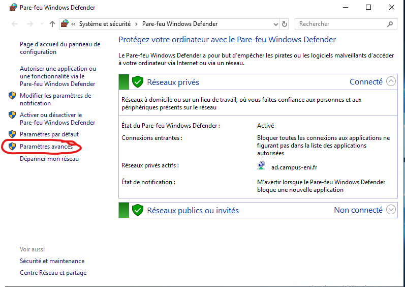
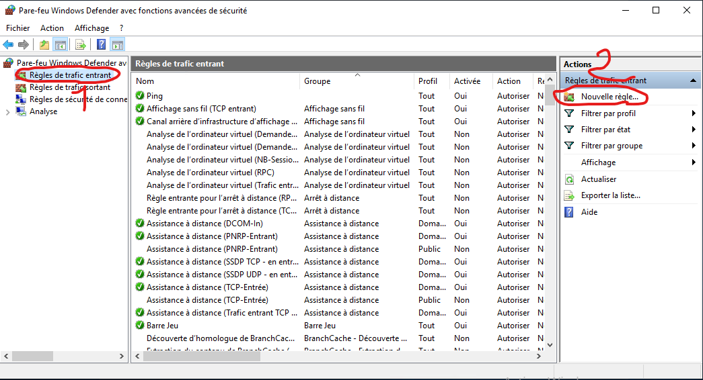
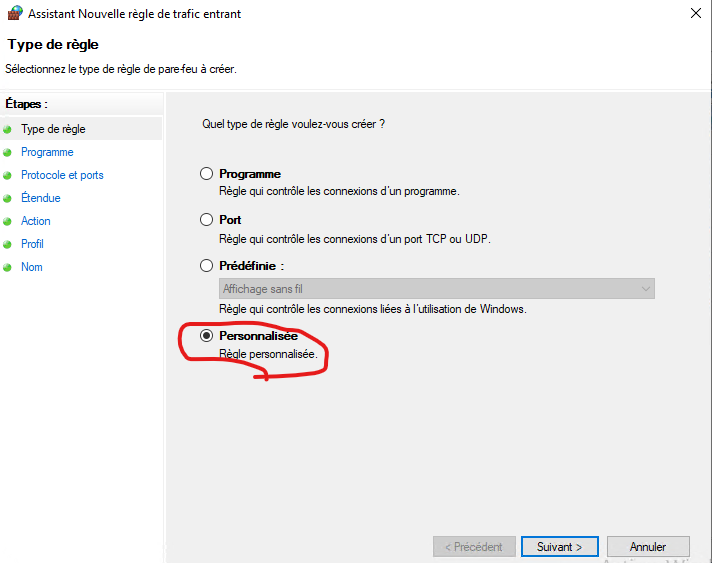
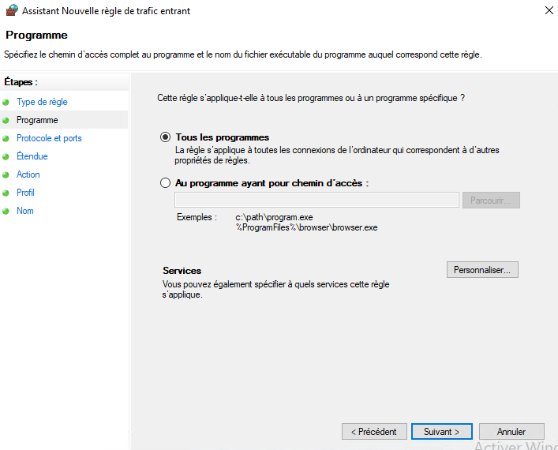
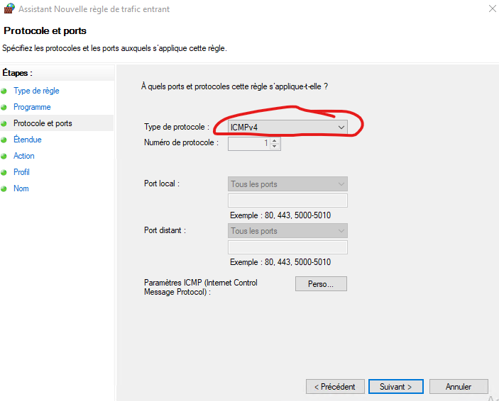
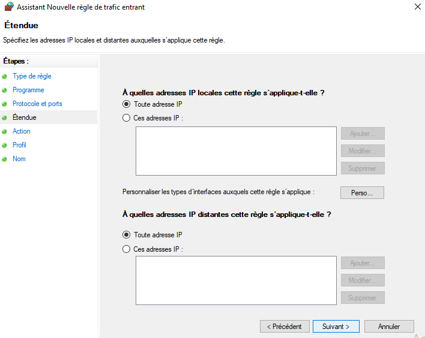
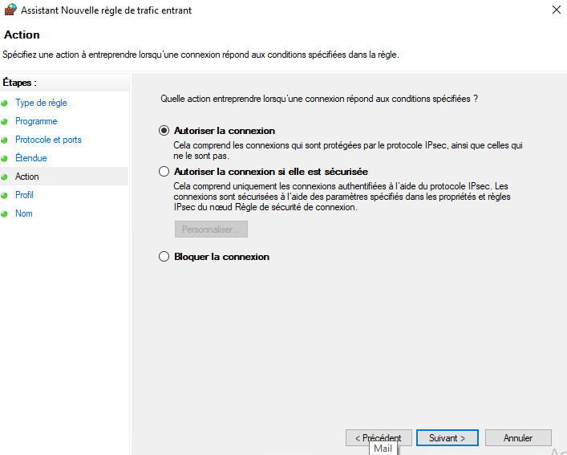
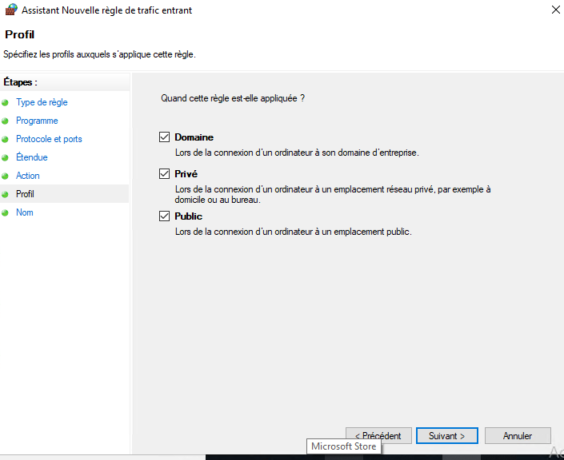
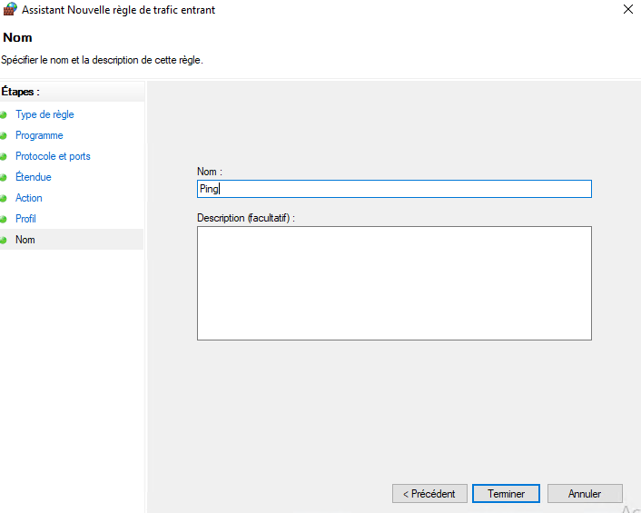

#### Autoriser le ping sur windows:
Il faut aller dans le pare feu windows:

> **NOTE** On peux ici limiter quel programme pourra utiliser le protocole icmpv4

> **NOTE** Ici on peux choisir  quelle type de connexion pourra se connecter

> **NOTE** On peux choisir quel type de connexion pourra avoir accès au ping

