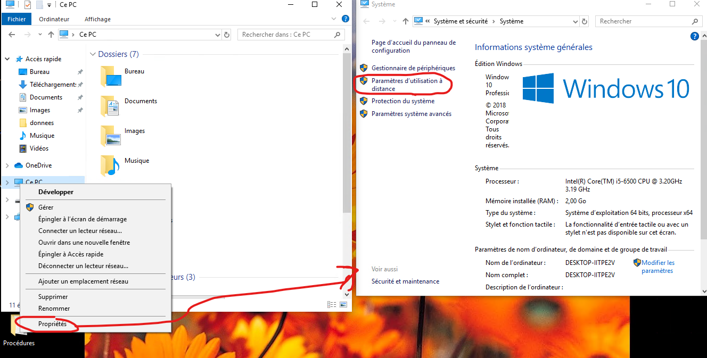
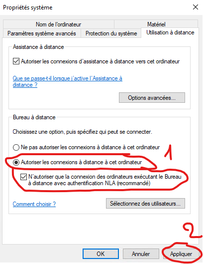
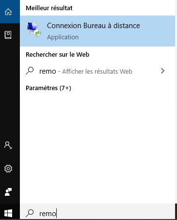

# Le bureau à distance

## 1. Activer le bureau à distance

Pour pouvoir utiliser le bureau à distance, il faut d'abord autoriser les connexions du bureau à distance:

Pour lancer le bureau à distance:  

il faut ensuite mettre l'adresse ip et les identifiants de connexion puis nous avons accès à la connexion à distance.