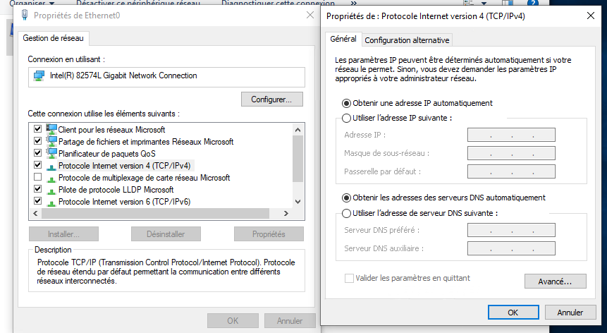

# Changer l'adresse ip

Il faut aller dans Paramètres -> Réseau et internet, dans la rubrique Etat, il faut aller dans Centre de réseau et partage.
Ensuite, il faut aller dans Modifier les paramètres de la carte (dans la colonne à gauche), clique droit sur la connexion de la carte réseau à modifier puis propriétés, on arrive sur cette fenêtre:

Dans les propriétés de Protocole Internet version 4, on change "obtenir une adresse IP automatiquement" en "Utiliser l'adresse IP suivante", on saisi ensuite notre IP, le masque et la passerelle.
