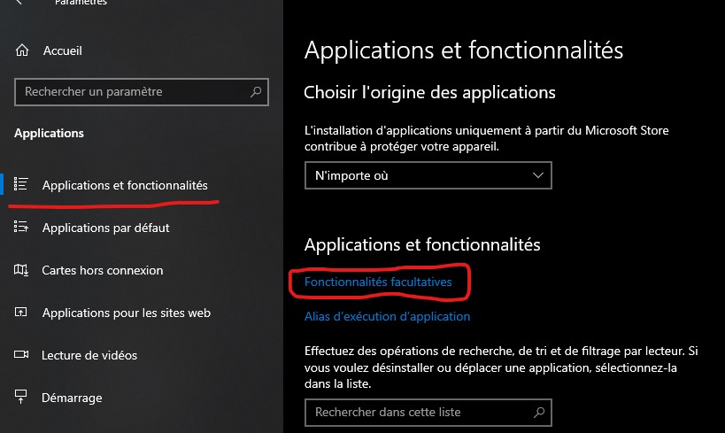
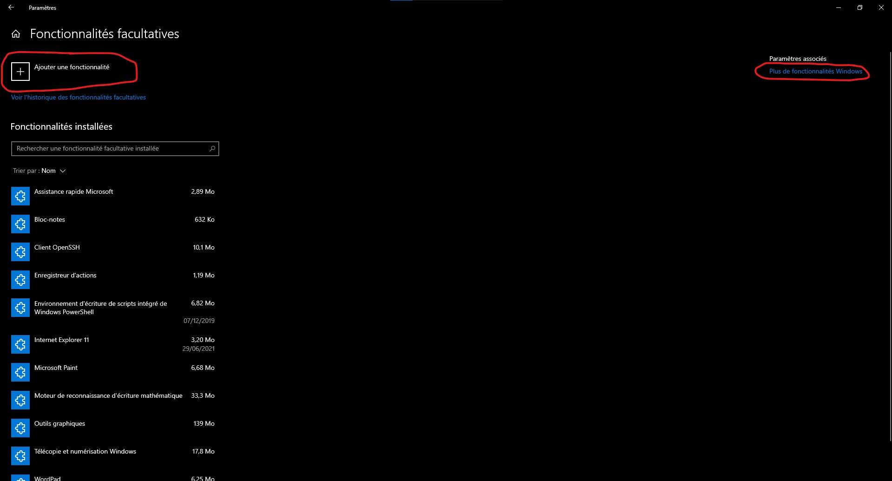
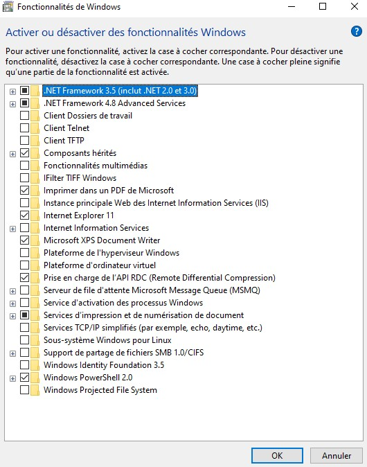

# Gestion des fonctionnalités de windows

Il y a 2 moyen de gérer les fonctionnalités de windows:

1. En allant dans Paramètres -> Applications -> Applications et fonctionnalités puis dans fonctionnalités facultative.

2. Ensuite, on peux gérer une partie des fonctionnalités depuis ce menu:

3. Si l'on veux installer des éléments plus Plus de fonctionnalités, visible sur la capture d'écran précédente. On arrive ensuite sur un menu de ce genre(en fonction des versions de windows):

Cette interfaces permet d'installer des fonctionnalités comme le serveur web, pour windows 10 pro Hyper V, la sandbox, ainsi que beaucoup d'autres outils qui peuvent être intéressant.