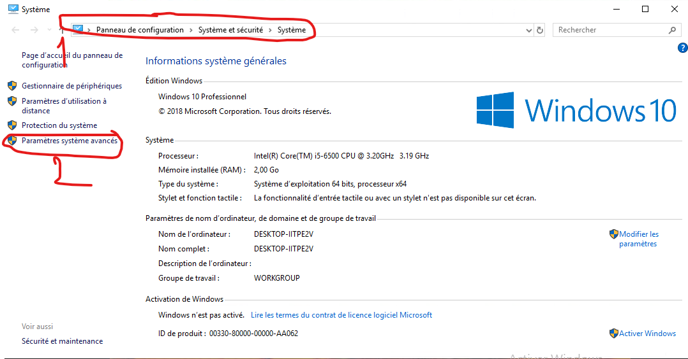
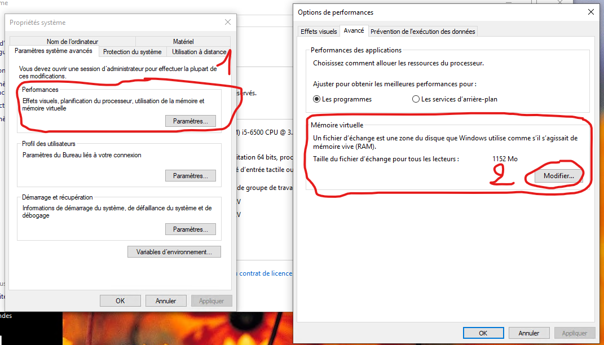
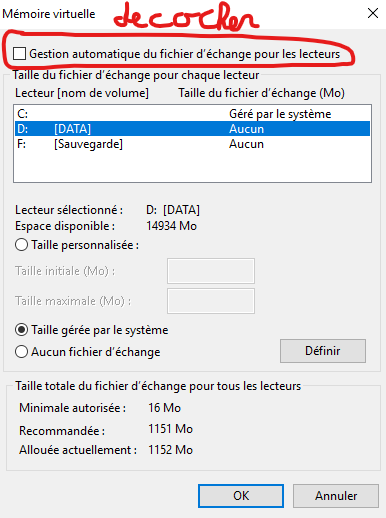

# Gestion du SWAP

## 1. Changer le disque utilisé pour le swap de windows

1. Aller dans Système -> paramètres systèmes avancés

2. Dans l'onglet Paramètres systèmes avancés puis dans la zone Performances, cliquer sur Paramètres... Puis dans la fenetre Options de performances, dans Avancé cliquer sur Modifier...
 

3. Après avoir décocher la case Gestion automatique du fichier d'échange pour les lecteurs
