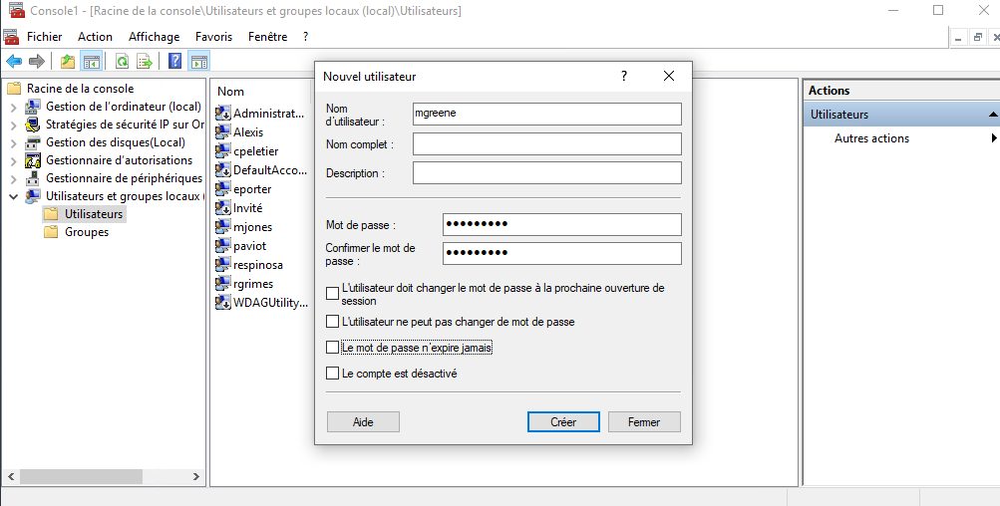

# Gestion des utilisateurs sur Windows 10

## 1. Crée un utilisateur via l'invite de commande
> **IMPORTANT** L'invite de commande doit être lancé en mode administrateur


Crée un utilisateur:
```
> net user nomutilisateur * /add
```

Ajouter un groupe:
```
> net localgroup nomdugroupe /add
```

Ajouter un utilisateur à un groupe:
```
> net localgroup nomgroupe nomutilisateur /add
```

Supprimer un groupe:
```
> net localgroup nomgroupe /delete
```

## 2. Gestion des groupes et utilisateurs via powershell
> **NOTE** Ces commandes concernent les utilisateurs et groupes locaux

> **NOTE 2** Penser à la commande get-gelp + commande pour avoir plus d'informations

Ajouter un groupe:
```
> New-LocalGroup -Name "nomdugroupe"
```
Crée un utilisateur:
```
> New-LocalUser -Name "nomutilisateur" 
```

Ajouter un utilisateur à un groupe:
```
> Add-LocalGroupMember -Group "nomgroupe" -Member "nomutilisateur"
```

## 3. Gestion des groupes en interface graphique

Depuis la console mmc ([Voir la procédure sur la Console MMC](Console%20mmc.md))

Pour ajouter ou modifier un utilisateur ou un groupe clique droit.


