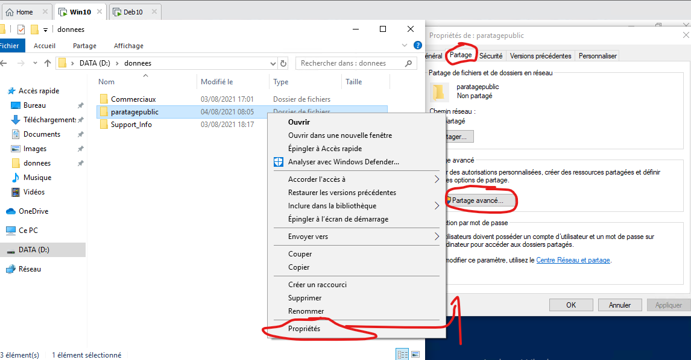
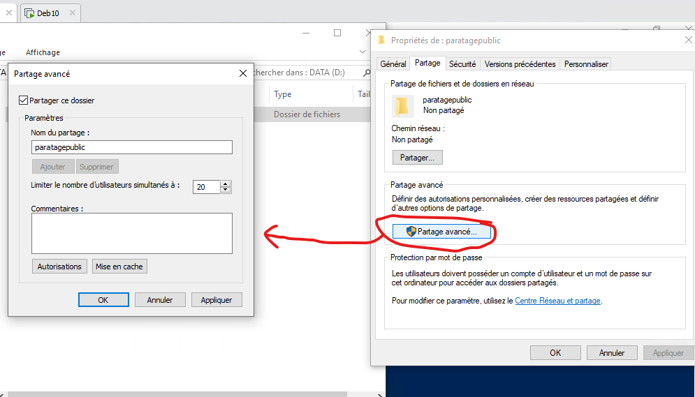
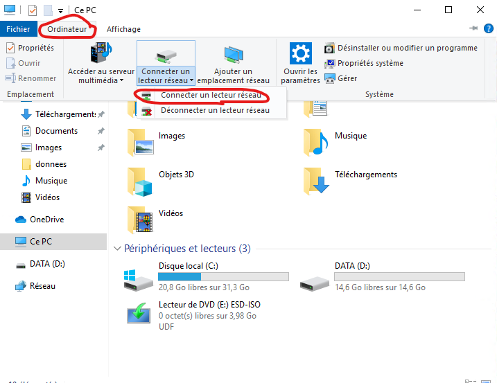
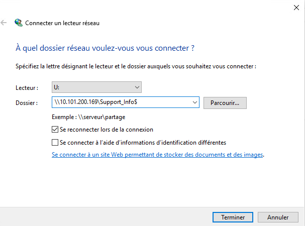

# Gestion des partages réseaux

> Pour afficher les paratages depuis l'invite de commande:  
> ```net share```


## 1. En interface graphique

1. Faire un clique droit -> propriétés sur le dossier a partager:


2. Cliquer sur Partage Avancé...


3. On peux choisir les accès:


> **NOTE** Pour masquer le partage, il faut mettre un $ à la fin du nom du partage

## 2. Avec powershell

Pour crée un partage:
```
New-SmbShare -name "nom du partage" -Path "chemin vers le dossier à partager" -FullAccess "Administrateurs","Informatique"
```
> A la fin du nom du partage, ajouter un $ cache le partage  
> Le paramètre FullAccess permet de donner l'accès complet à un groupe d'utilisateur  
> NoAccess permet de bloquer l'accès à un groupe d'utilisateur

Pour afficher partages:
```
Get-SmbShare 
Get-SmbShareAccess
```


## 3. Connecter un lecteur réseau




> Si le partage est caché, mettre un $ à la fin