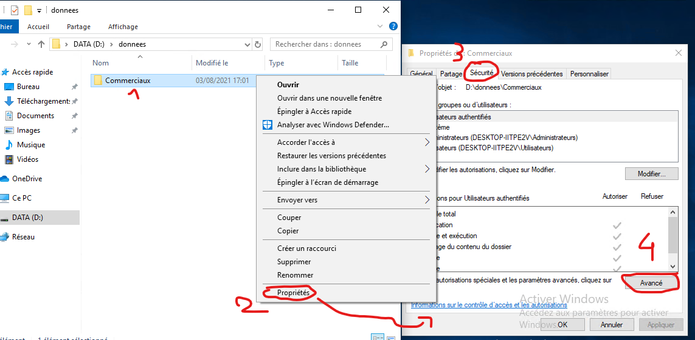

# Gestion des droits d'accès des dossiers

## 1. En interface graphique
Pour gérer les accès auxx dossiers, il faut faire clique droit sur le dossier, aller dans propriétés puis dans l'onglet sécurité et enfin Avancé

Il faut ensuite, dans l'interface, désactivé l'héritage des accès, attention à bien choisir "Convertir les autoraisations héritées en autorisations explicites sur cet objet

On peux ensuite ajouter et supprimer des groupes d'utilisateur qui auront accès ou pas au dossier.

> **IMPORTANT** Pour que les modifications soient vraiment effectives, il faut supprimer l'accès à l'utilisateur utilisateur authentifiés.

## 2. Avec powershell

Il est également possible de le faire via powershell

TODO Compléter cette page  
https://pbarth.fr/node/294  
https://www.tutos.eu/5567  
https://blog.netwrix.fr/2018/12/12/comment-gerer-les-listes-de-controle-dacces-acl-au-systeme-de-fichiers-avec-les-scripts-powershell/  

