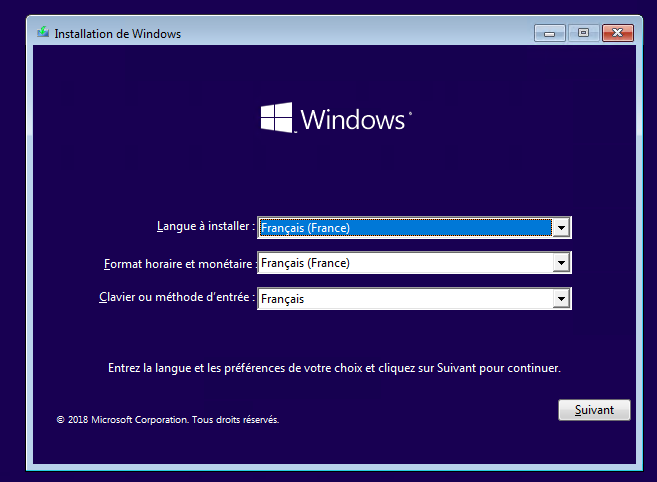
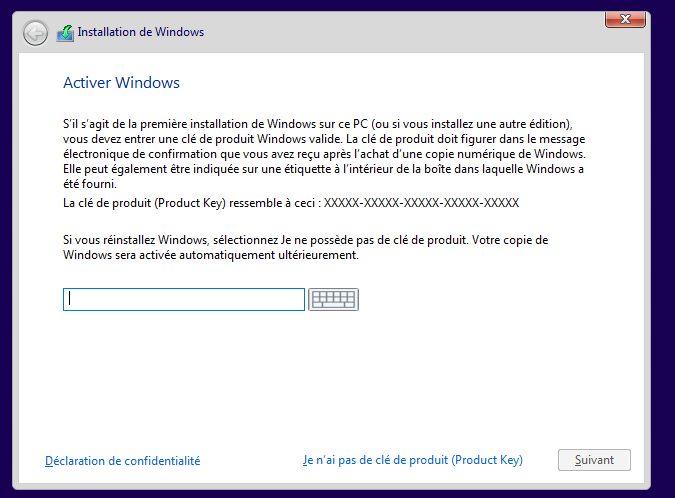
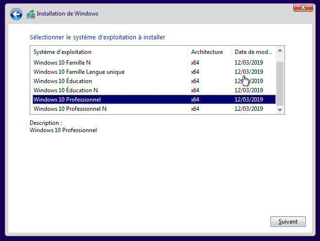
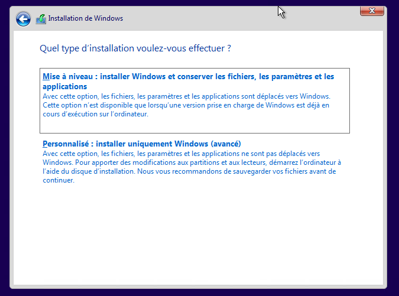
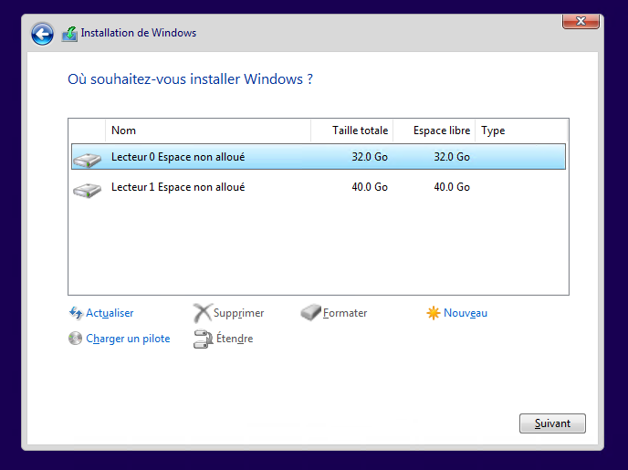
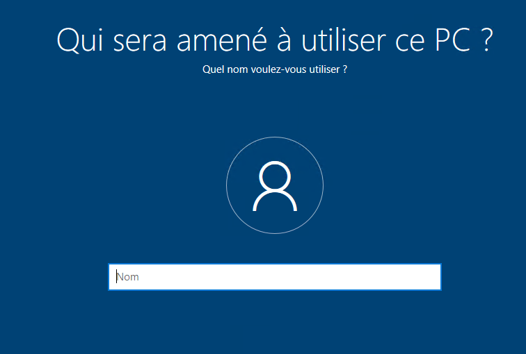
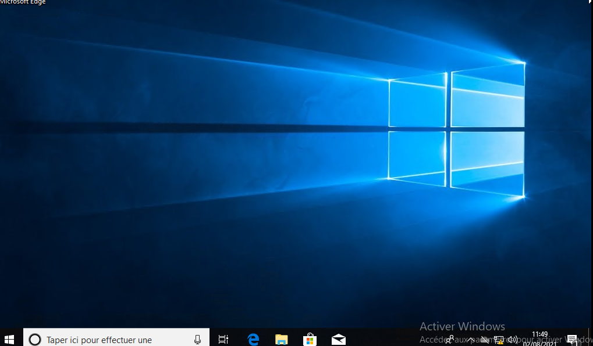

# Installation Windows 10

Pour commencer, il faut démarrer sur le média d'installation, ensuite on arrive sur l'écran suivant:

Ensuite on choisi d'installer maintenant puis on se retrouve sur le menu de la licence de windows, il y a plusieurs possibilitées/

> Si l'ordinateur à une clé numérique et que le média d'installation contient la clé, cette étape n'est pas visible.  
> Si on à un clé à saisir, c'est le moment  
> Sinon, on peux très bien utiliser windows 10 sans utiliser de licence.  
> Si on ne saisi pas de clé de licence, on arrive sur cet écran de choix de version à installer:
>

Ensuite, après avoir accepté les termes du contrat, on arrive sur cet écran:  

Ici on a 2 possibilitées:
 - Dans le cas ou l'on veux juste mettre à jour windows 10 vers une version plus récente, on choisi mise à niveau.  
 - Dans le cas ou l'on souhaite une nouvelle installation, il faut choisir personnalisé

**Pour la suite je vais considérer que l'on a choisi le mode personnalisé**

On arrive donc sur l'insterface de gestion de disque, on peux partitionner les disque ici, cependant il peux être mieux de le faire plus tard, c'est ce que nous allons faire, il suffit de choisir le disque ou s'installera le système puis cliquer sur entrer.

L'installation se lance ensuite.

Après avoir redémarrer, on choisi le langage à utiliser et la disposition du clavier.

> **IMPORTANT**  
> Au moment de nous connecter au réseau, windows 10 va demander de se connecter à internet et de se connecter avec un compte, crée un compte local étant mieux, il faut cliquer sur ignorer pour le moment pour pouvoir crée hun compte local.

On choisi ensuite notre nom d'utilisateur:

Il est ensuite demander de saisir un mot de passe et des question/réponses secrètes.

Enfin, il faut de préférence, refuser Cortana ainsi que les autres personnalisations.

On arrive finalement sur le bureau:

On peux ensuite paramétrer windows comme on le souhaite.