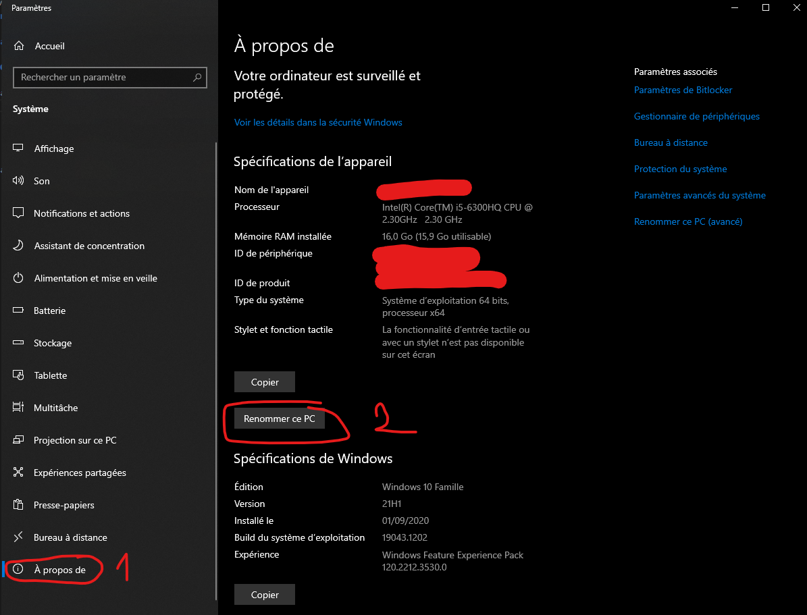
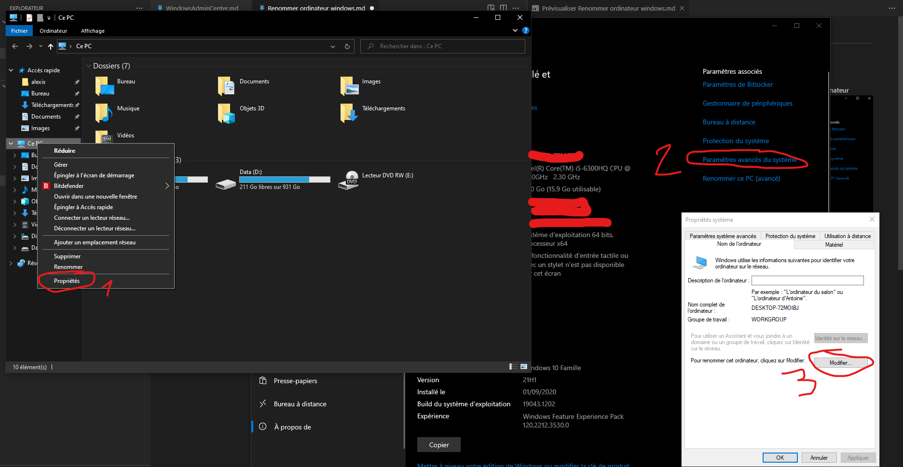

# Renommer un ordinateur sous Windows

## En interface graphique


1. Aller dans les paramètres -> Système -> A propos de , puis cliquer sur renommer l'ordinateur
    

Il suffit de saisir le nouveau nom de l'ordinateur puis redémarrer pour que les modifications soit prisent en compte.

2. Autre méthode, en passant par un explorateur de fichier -> clique droit sur Ce PC -> propriété -> paramètres avancés du système -> Nom de l'ordinateur -> Renommer.



3.  En supplément, sous windows server, on peux directement passer par le gestionnaire de serveur.


## Avec Powershell

Il suffit d'utiliser la commande:

``` powershell
 Rename-Computer -NewName "nouveau nom" -Restart
 ```