Sauvegarde sur Windows 10

### 6.2.1 Crée une image système

1. Aller dans le panneau de configuration
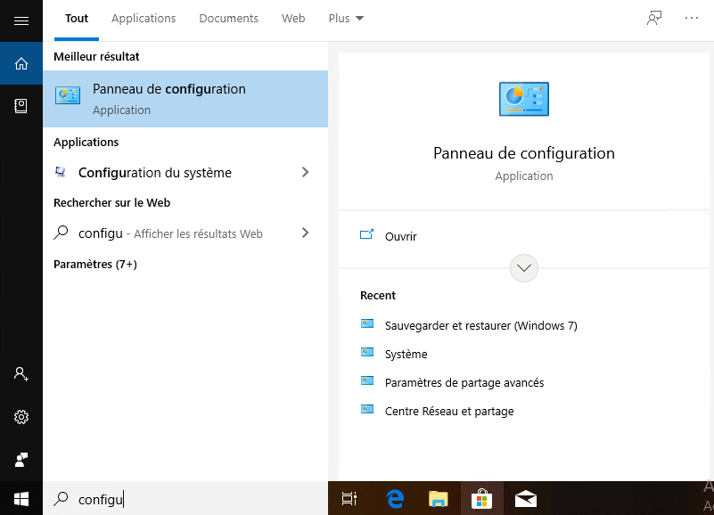
2. Aller dans sauvegarder et restaurer
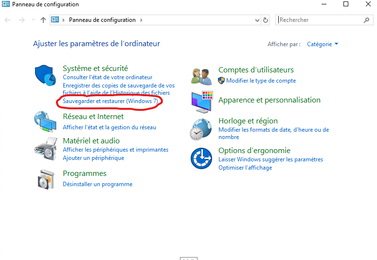
3. Cliquer sur crée une image système
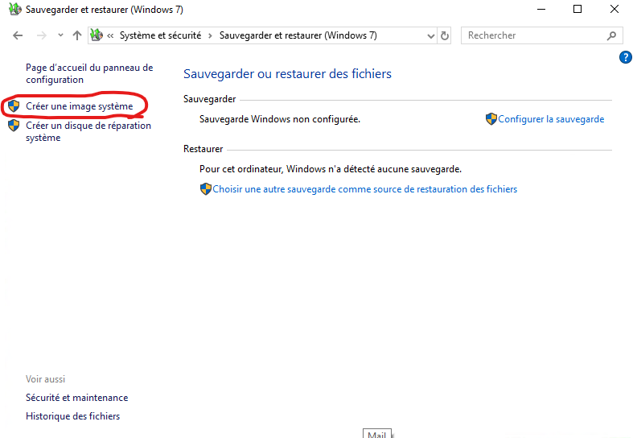
4. Choisir le lecteur qui servira de stockage pour la sauvegarde
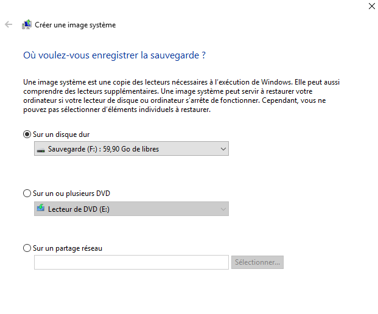
5. On choisi les lecteurs à sauvegarder

6. Cliquer ensuite sur Démarrer la sauvegarde si tout est correct

### 6.2.2 Programmer une sauvegarde de windows

1. Aller dans le panneau de configuration
   
2. Aller dans sauvegarder et restaurer 

3. Cliquer sur Configurer la sauvegarde
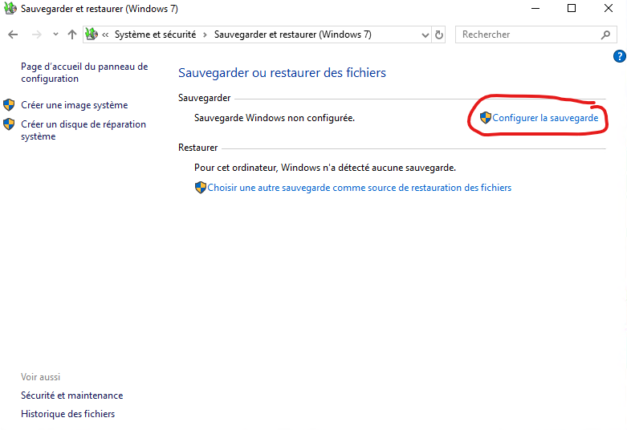
4. Choisir l'emplacement de la sauvegarde
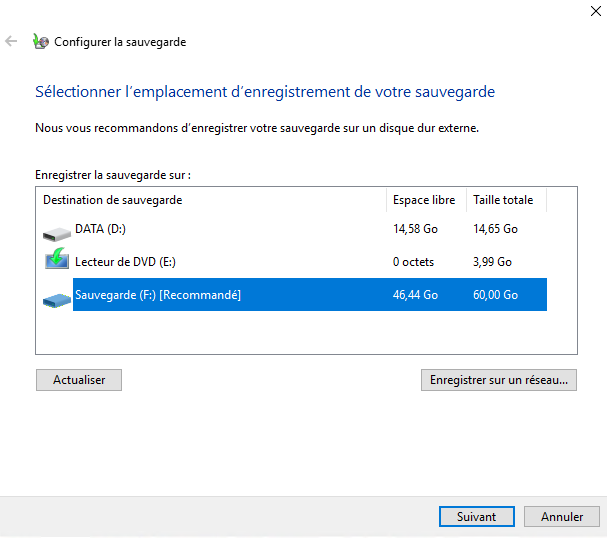
5. On choisi si on veux que windows chosisse quand sauvegarder ou bien si l'on préfère choisir nous même quand le système sera sauvegarder (normalement, si on viens ici, c'est pour une configuration manuelle)
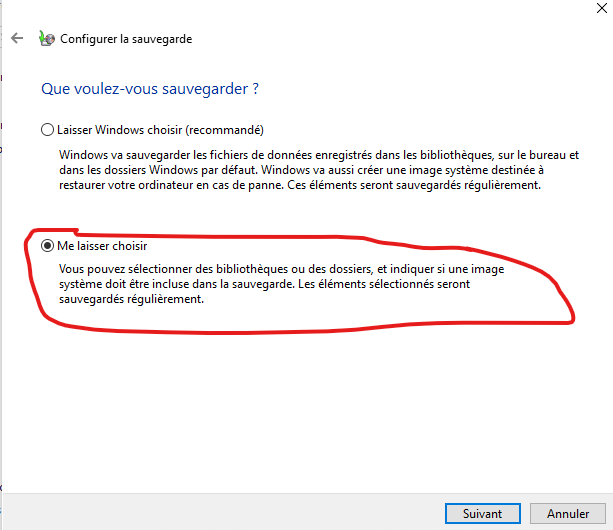
6. On choisi ce qui sera sauvegardé
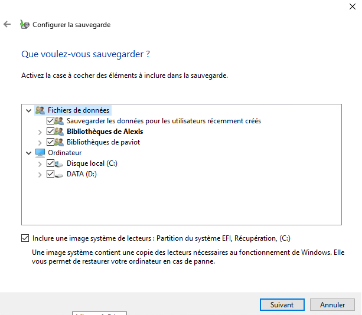
7. Ici on peux continuer ou choisir quand la sauvegarde se lancera
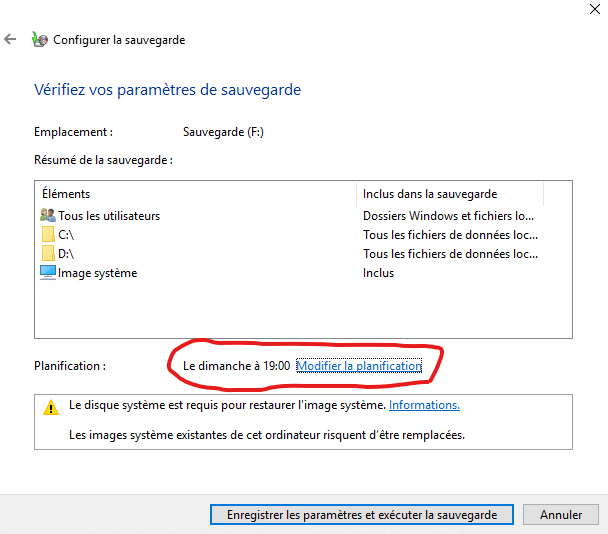
8. Si on veux un moment personnalisé de sauvegarde, on le choisi:
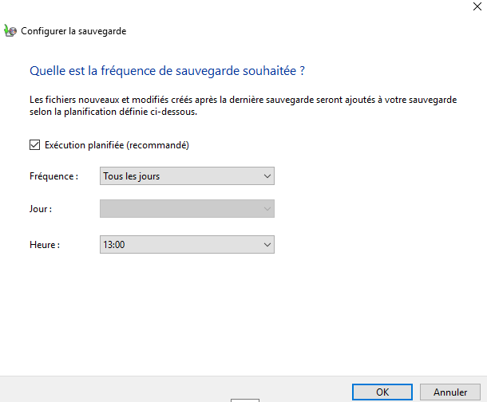
9. On valide et on termine

### 6.2.3 Paramétrage des points de restauration

Tout abord, on active les point de restauration:

1. On va dans système
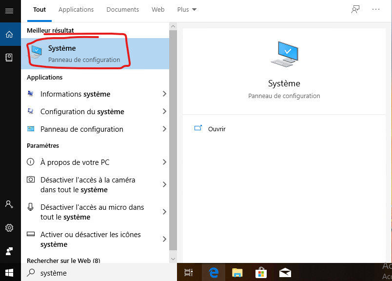

2. On va ensuite dans Protection du système puis on choisi l'onglet Protection du système puis on choisi le disque à mettre en point de restauration et on clique sur configurer
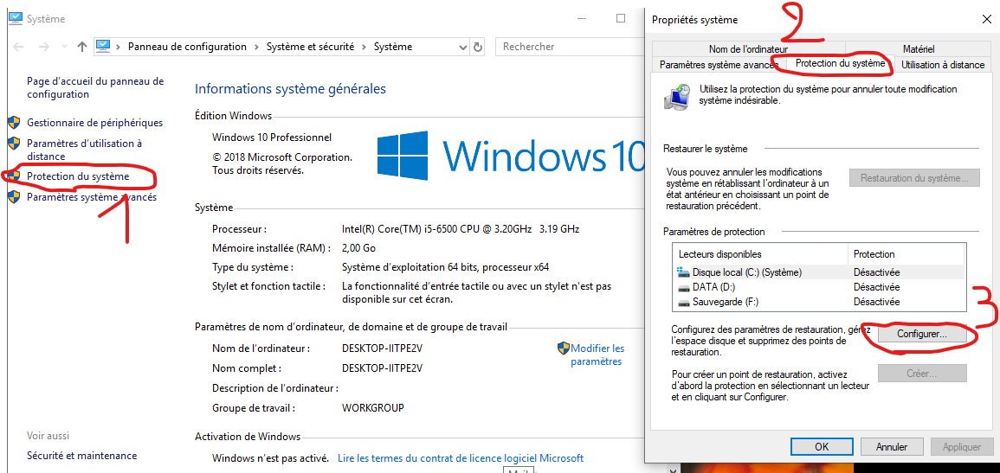

3. On active la protection du système (en choisissant le % de la capacité du lecteur maximale)
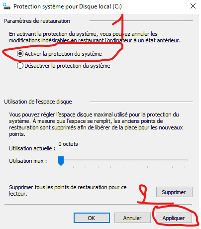