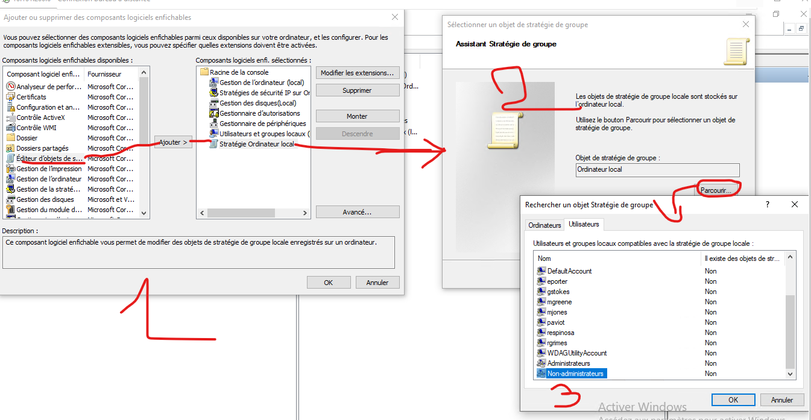
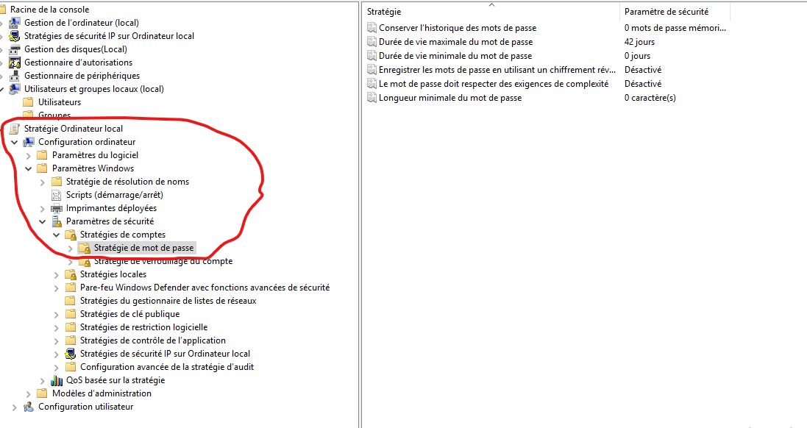
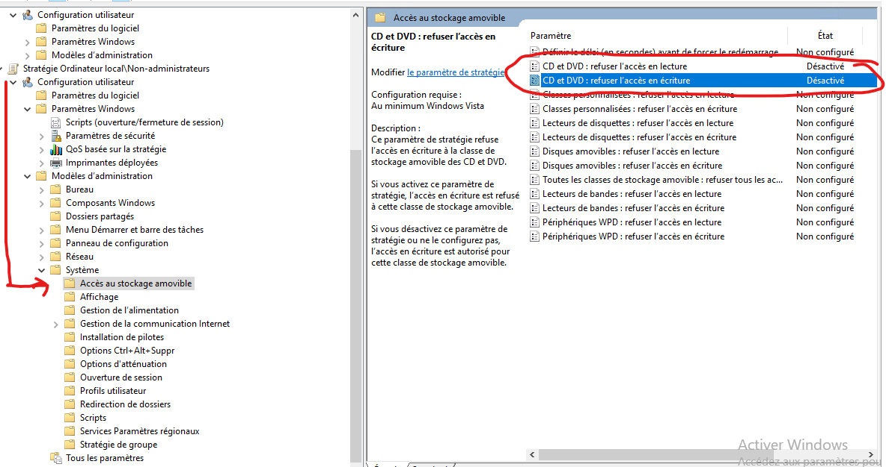
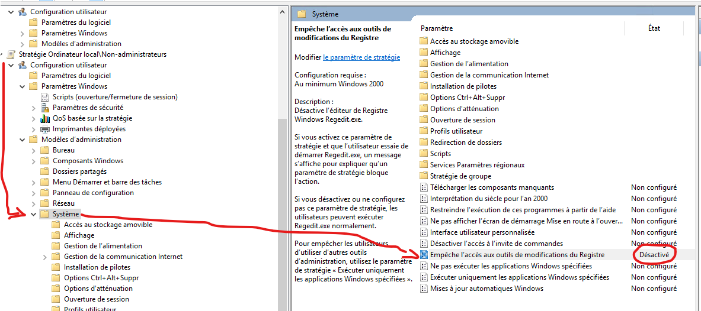
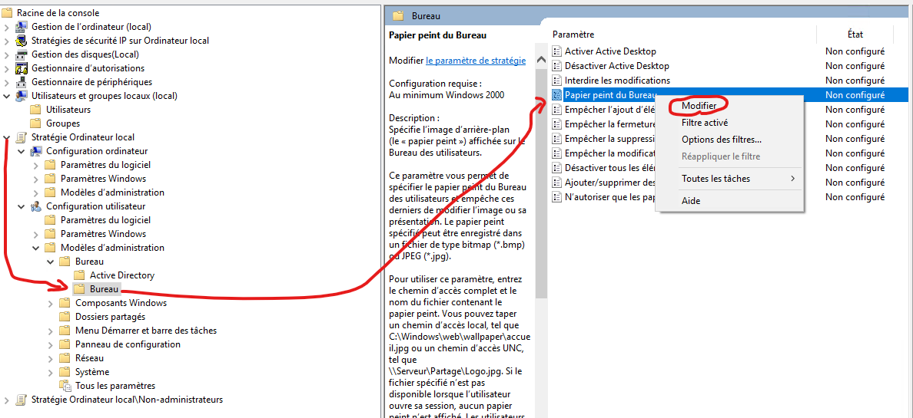
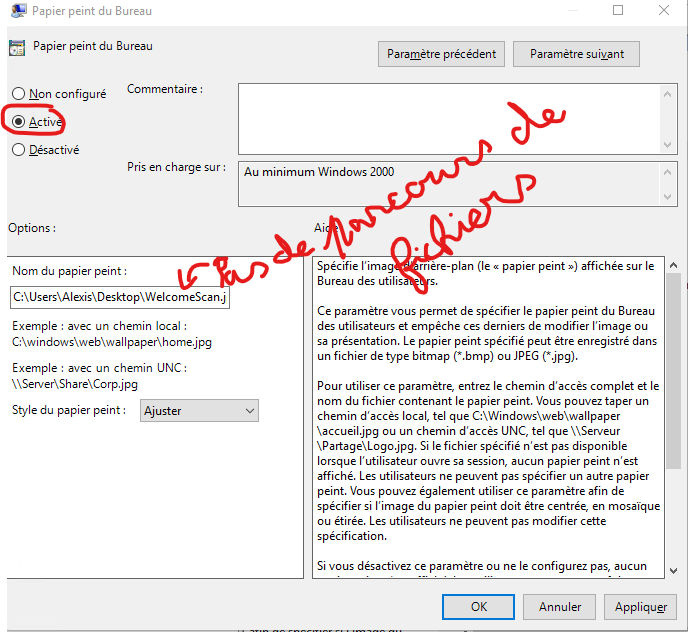

# Stratégies de groupes locaux

Tout d'abord, il faut passer de préférence par la console MMC ([lien vers l'article](Console%20mmc.md)).  

Ensuite, on peux soit crée une règle pour la Stratégie de l'ordinateur local, soit on peux crée une règle appliquée à certains utilisateurs du groupe local.

Par exemple, ici on va ajouter une stratégie pour les utilisateurs non administrateurs:

Dans le cas ou l'on souhaite que cela ne s'applique à tous les utilisateurs, au moment ou l'on doit choisir l'objet, il faut laisser Ordinateur local.

## 1. Changer la stratégie des mots de passe utilisateurs
Ensuite on va dans configuration de l'ordinateur -> Paramètres Windows -> Paramètres de sécurité -> Stratégies de comptes -> Stratégies de mot de passe

## 2. Gérer les autorisations utilisateurs:

>**NOTE**  
> Dans l'exemple, j'applique les règles pour les personnes non administratrices, cela ne change rien si on veux appliquer à d'autres utilisateurs.

### 2.1 Bloquer l'accès au lecteur cd/dvd:

### 2.2 Bloquer l'accès l'éditeur de registre:

### 2.3 Forcer l'utilisation d'un fond d'écran forcé ) tout les utilisateurs:

