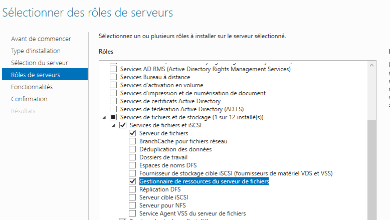
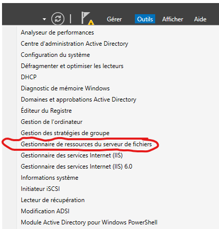
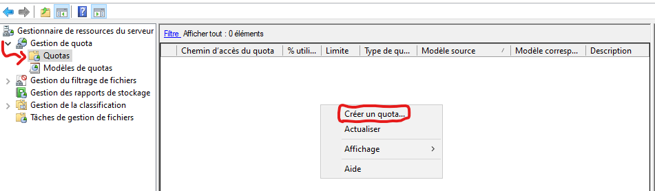
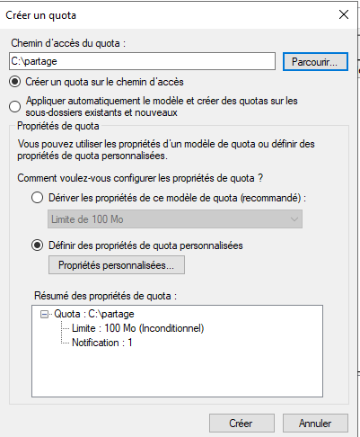
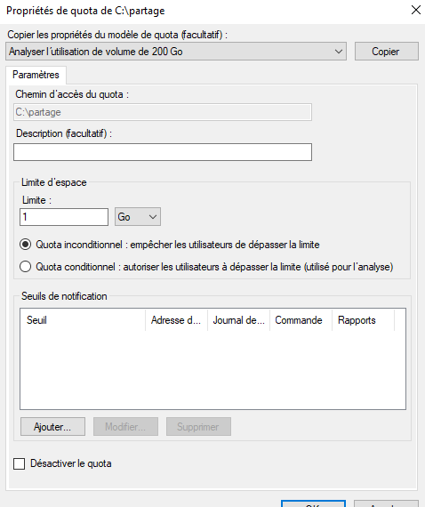

# Gérer le quota des partages de windows server

## 1. Installer le role

Sur la console de gestion du serveur, il faut ajouter le role gestionnaire de ressources du serveur de fichiers.
  

## 2. Crée un quota

Sur le gestionnaire de serveur, aller dans Outils -> Gestionnaire de ressources du serveur de fichiers

Il faut ensuite aller dans Gestion de quota -> Quotas puis faire un clique droit puis cliquer sur Créer un quota...

Ensuite, on doit choisir le chemin d'accès du dossier qui possèdera un quota. On peux ensuite choisir les propriétés du quote, on peux utiliser un modèle de quota ou bien choisir Définir des propriétés de quota personnalisées puis les paramétrer en allant dans l'option Définir des propriétés de quota personnalisées.

## 3. les propriétés du quota

Sur la fenêtre des propriétés, on peux choisir en tout premier l'utilisation d'un modèle de quota.
Ensuite, il faut indiquer la limite du quota ainsi que si l'on souhaite le limiter à tous les utilisateurs ou bien laisser certains utilisateurs dépasser cette limite.

## 4. Liens utiles
[https://www.pc2s.fr/gestion-des-quotas-de-volumes-et-de-dossiers-windows-serveur-2019-2016-2012-r2/](https://www.pc2s.fr/gestion-des-quotas-de-volumes-et-de-dossiers-windows-serveur-2019-2016-2012-r2/)
[https://rdr-it.com/windows-serveur-appliquer-des-quotas-sur-des-dossiers/](https://rdr-it.com/windows-serveur-appliquer-des-quotas-sur-des-dossiers/)