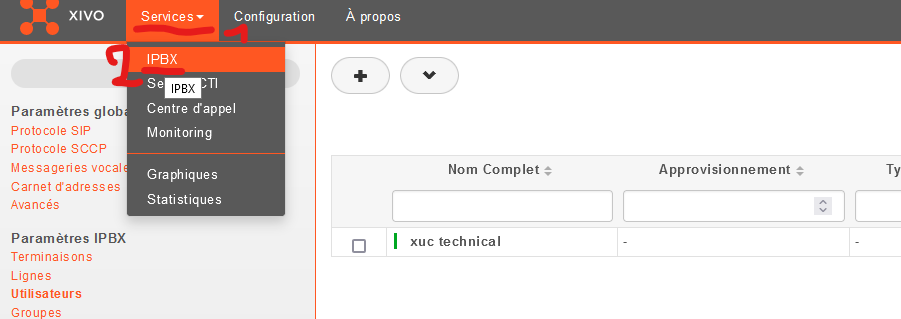
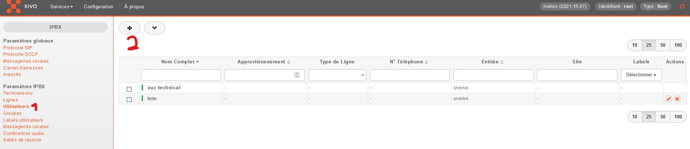

# Ajouter une ligne sur Xivo

## 1. Création de la ligne

Se connecter sur l'interface de Xivo puis aller dans Services -> IPBX

Ensuite, dans les paramètres IPBX, il faut aller créer un utilisateur en cliquant sur Utilisateurs puis sur le + -> ajouter:

Ensuite, il faut crée une terminaison et une ligne. Dans les paramètres de la ligne, il faut récupérer les identifiants et les saisir dans zoiper.

